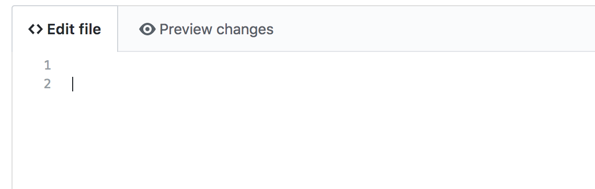
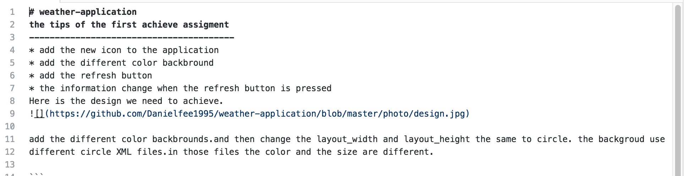
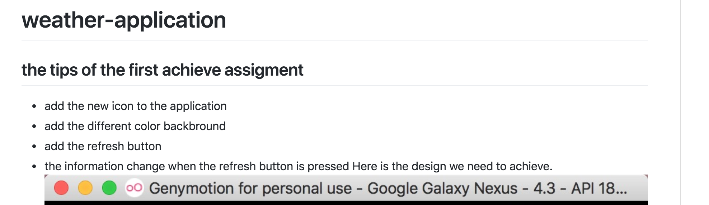

# 濡�浣�缂�杈�涓�涓�markdown���浠�

<<<<<<< HEAD

md文件指的是这个文件，在这里可以编辑。

在这里写需要写的东西，旁边的这个是可以查看写出来的是什么效果。下面这个是我自己的效果

效果：

至于格式的话就可以上网查询，你所需要的的样式。这里有个网址可以参考：[http://blog.csdn.net/zhao_jing_bo/article/details/68063070]http://blog.csdn.net/zhao_jing_bo/article/details/68063070
（温馨提示，图片尽量在本地GitHub的项目中新建一个文件，这样好一点。在本地仓库中放好图片，并编辑md文件，然后直接一起上传到远程仓库。我的编辑是这么写的：[https://github.com/Danielfee1995/weather-application/blob/master/photo/design.jpg](https://github.com/Danielfee1995/weather-application/blob/master/photo/design.jpg) 。剩下的就没什么了，可以操作了。
=======
>>>>>>> 1e33c7d8f4861487b1f09722cb1b30e4e4955d45
